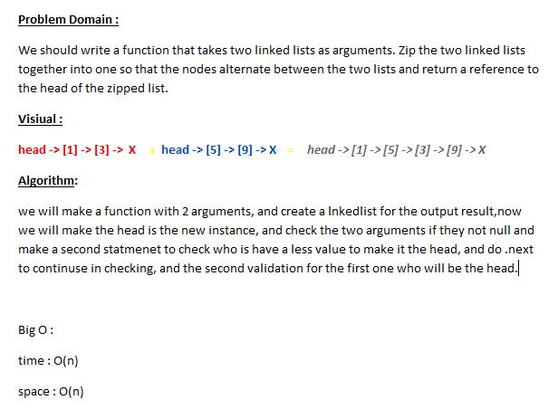

## Challenge 
**Write a function takes two linked lists as an arguments and merge them Return the new linked list**

## Approach & Efficiency
* while
* two if statment

### Big O
* time: O(n) 
* space: O(n)

### Whiteboard

