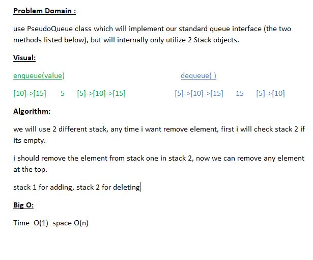

## Challenge 
**use PseudoQueue class which will implement our standard queue interface (the two methods listed below), but will internally only utilize 2 Stack objects.**

## Approach & Efficiency

**we will use 2 different stack, any time i want remove element, first i will check stack 2 if its empty.**

**Big O: Time  O(1)  space O(n)**

### UML 
