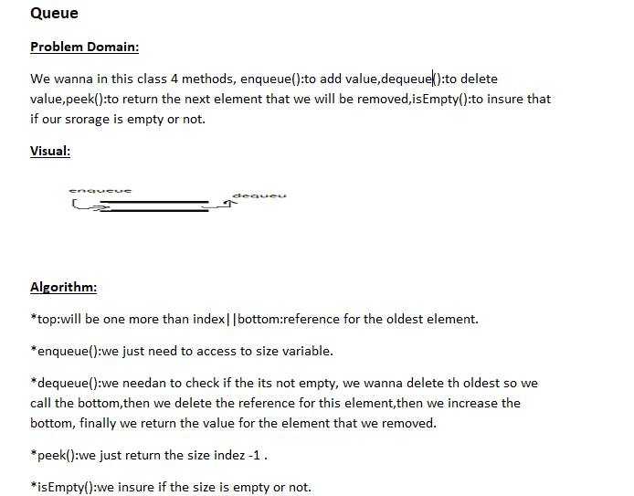
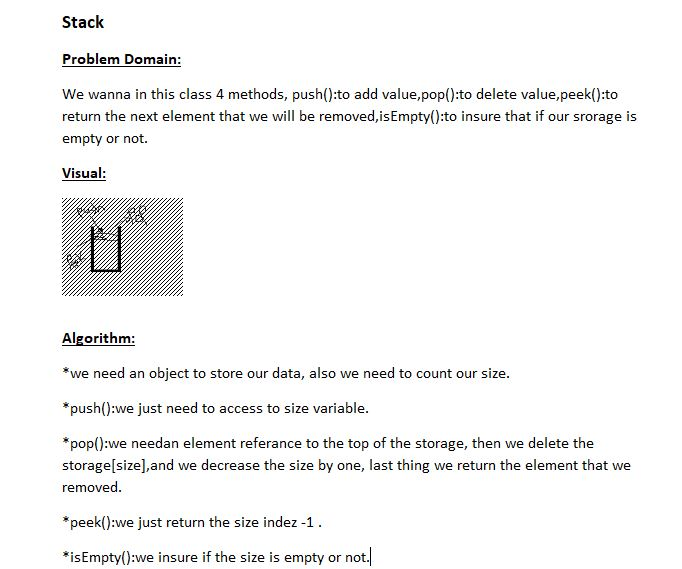

## Challenge 
**we need in this challeng to use Queue and stack method to add and delete element also check if our storage is empty, and finally make a reference to the next element that we want to remove it**

## Approach & Efficiency

**For Stack i wrote class and 4 methods, push():to add value,pop():to delete value,peek():to return the next element that we will be removed,isEmpty():to insure that if our srorage is empty or not.**

**For Queue i wrote class and 4 methods, enqueue():to add value,dequeue():to delete value,peek():to return the next element that we will be removed,isEmpty():to insure that if our srorage is empty or not.**

#### Big O :
**space O(1)**
**time O(n^2)**

## Solution

