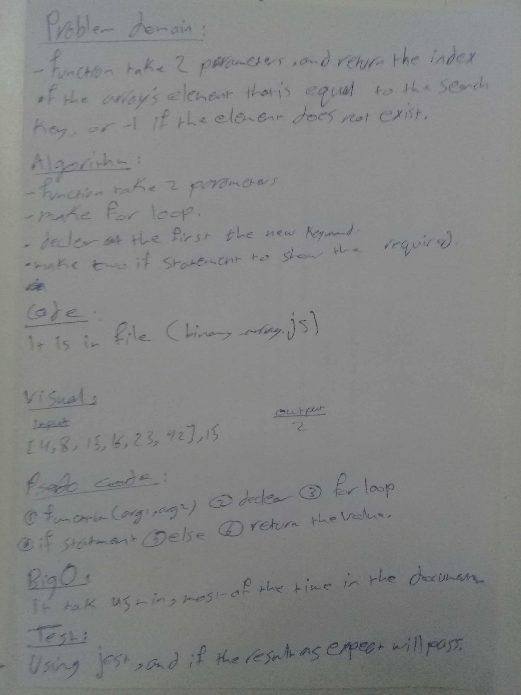

# array Binary Search
write function name BinarySearch with two arguments

## Challenge

I should return the index of the array’s element that is equal to the search key, or -1 if the element does not exist.

## Approach & Efficiency
-Fistly i make loop.
-Then if statment.

## Big O
time O(log n) *(if the length of array increase the time increas)* space O(1) **Time**: worst case: if the size of array big. **Space**: the input is array and number, but the output is a number. 

## Solution
