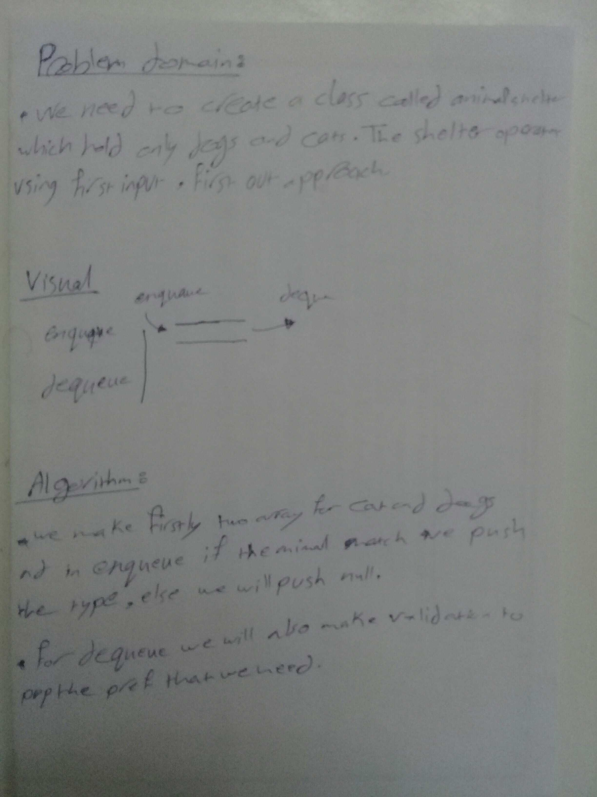

# Challenge
**We have to know how to deal with stack and queue and what is the structure of it.**

**Create a class called AnimalShelter which holds only dogs and cats. The shelter operates using a first-in, first-out approach. Implement the following methods:**

* enqueue(animal): adds animal to the shelter. animal can be either a dog or a cat object.
* dequeue(pref): returns either a dog or a cat. If pref is not "dog" or "cat" then return null.

## Approach & Efficiency
* Space : O(1)
* Time : O(1).

## Solution
 
 #### whiteboard image -->
 
