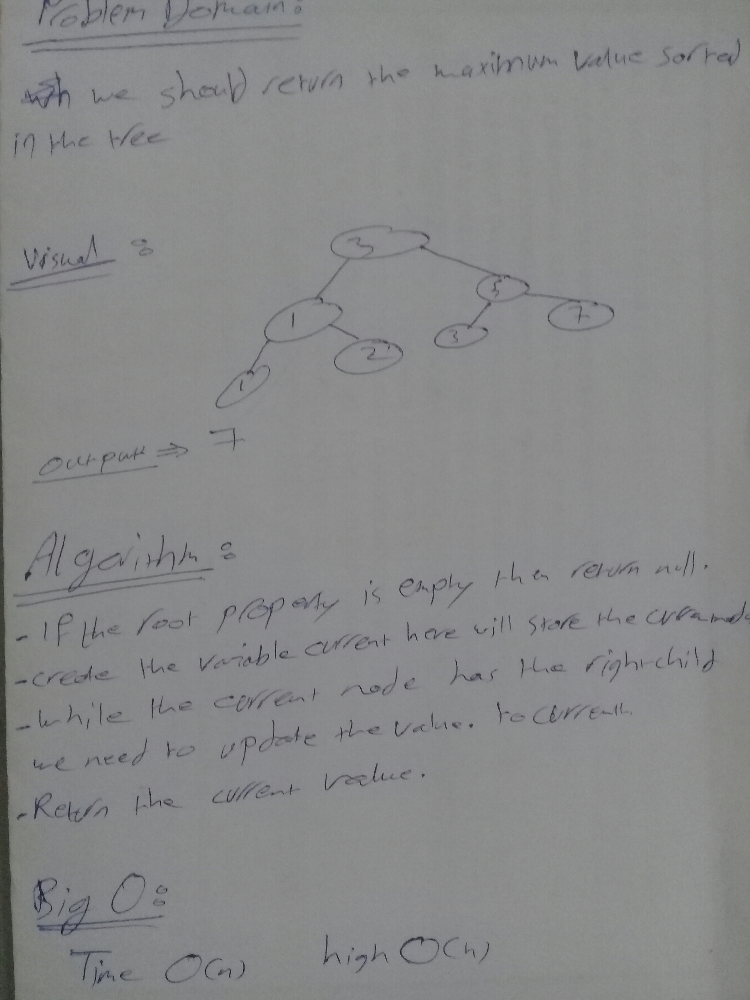

# Challenge Summary
**method return the maximum value stored in the tree.**

## Challenge Description

**Since in the binary search tree the value is already sorted to get the maximum value we need to get the value of the right child node.**

## Approach & Efficiency

### Big O :

* time O(n)
* high O(h) 

## Solution
 **Since in the binary search tree the value is already sorted to get the maximum value we need to get the value of the right child node.**

### UML 

