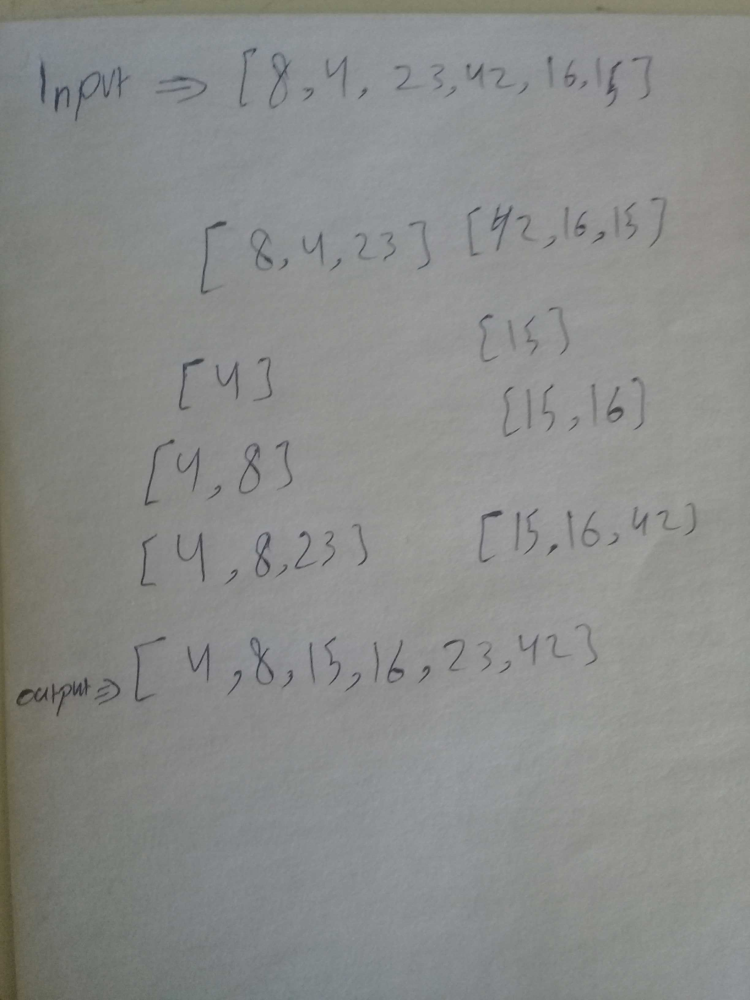

# Merge Sort

## Challenge

**Merge sort is an example of a divide-and-conquer type sorting-algorithm. The input for merge sort is an array of integers of length n, which needs to be sorted, typically from least to greatest.**

## algorithm

 **What merge sort does is it splits the unsorted array into two parts and then you recursively apply merge sort to these sub-arrays to further split the arrays until you are left with a bunch of single-element arrays. Then, you compare single-element arrays to one another before recombining them into a two-element, sorted array (and so on).**

## Pseudocode

ALGORITHM Mergesort(arr)
    DECLARE n <-- arr.length
           
    if n > 1
      DECLARE mid <-- n/2
      DECLARE left <-- arr[0...mid]
      DECLARE right <-- arr[mid...n]
      // sort the left side
      Mergesort(left)
      // sort the right side
      Mergesort(right)
      // merge the sorted left and right sides together
      Merge(left, right, arr)

ALGORITHM Merge(left, right, arr)
    DECLARE i <-- 0
    DECLARE j <-- 0
    DECLARE k <-- 0

    while i < left.length && j < right.length
        if left[i] <= right[j]
            arr[k] <-- left[i]
            i <-- i + 1
        else
            arr[k] <-- right[j]
            j <-- j + 1
            
        k <-- k + 1

    if i = left.length
       set remaining entries in arr to remaining values in right
    else
       set remaining entries in arr to remaining values in left

## Approach & Efficiency

### Big O :
* Time : O(nlogn)

