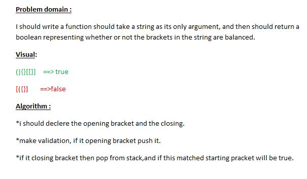

## Challenge 
**I should write a function should take a string as its only argument, and then should return a boolean representing whether or not the brackets in the string are balanced.**

## Approach & Efficiency

**we will use for loop and 2 if statement**

### UML 
