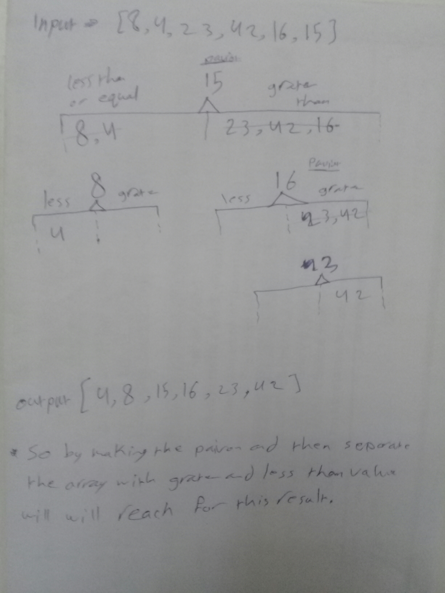

# Challenge 

**Review the pseudocode, then trace the algorithm by stepping through the process with the provided sample array.**
**Document your explanation by creating a blog article that shows the step-by-step output after each iteration through some sort of visual.**

## Challenge Description
**convert pseudo code for the quickSort function to real code.**

## Approach & Efficiency
**time O(n) because we have just one for loop, space O(1) because the input same of output in memory.**

## Solution
