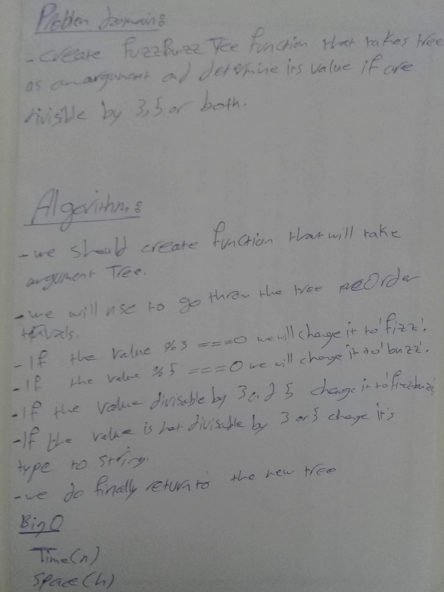

# data-structures-and-algorithms

## FizzBuzzTree:

**create a FizzBuzzTree function that takes tree as an argument and determine its value if are divisible 
by 3, 5 or both**

## Challenge
**Create a function called FizzBuzzTree which takes a tree as an argument, , determine whether or not the value of each node is divisible by 3, 5 or both.**

## Approach & Efficiency
* Big O (for time )
* Big O (for space)

## Solution

### UML

