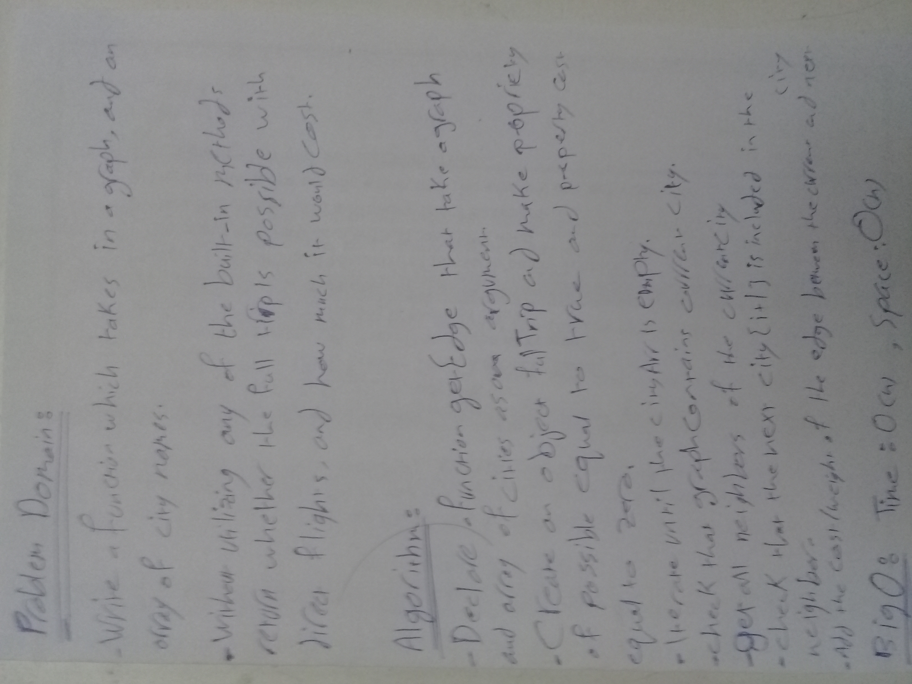

# Get-Edge

## Challenge

**Write a function based on the specifications above, which takes in a graph, and an array of city names. Without utilizing any of the built-in methods available to your language, return whether the full trip is possible with direct flights, and how much it would cost.**

## Approach & Efficiency

**I used ES6 class syntax to create my own Graph class. To make my implementation concise and understandable, I also created a Vertex and Edge class that the Graph's methods could use.**

### Big O
Time : O(n) Space : O(n)

## solution
#### UML 
