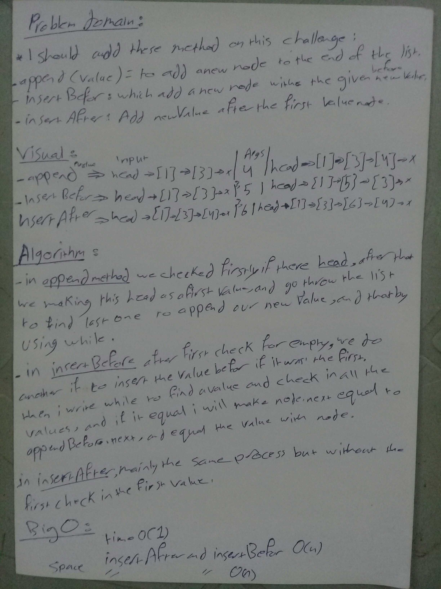

# data-structures-and-algorithms

# Linked list insertions.

## Challenge :

### write these method in linkedlist class :
* append(value) which adds a new node with the given value to the end of the list
* insertBefore(value, newVal) which add a new node with the given newValue immediately before the first value node
* insertAfter(value, newVal) which add a new node with the given newValue immediately after the first value node

## Approach & Efficiency

* class
* if statment 
* while loop
* Big(O): 
* Big O :
    * append method
       space --> O(1)
       time --> O(n)
    * insertBefore method
       space --> O(1)
       time --> O(n)
    * insertAfter method
       space --> O(1)
        time --> O(n)

 space insertAfter and insertBefore O(n)

 
