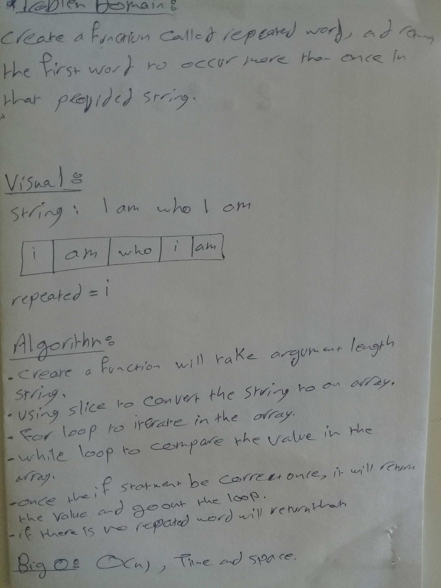

# repeated-word

**create a repeated-word function that takes lengthy string parameter and returns the first repeated word**

## Challenge
**Create a function called repeated-word which takes a lengthy string paramete, and returns the first word to occur more than once in that provided string.**

## Approach & Efficiency
* Create a function called repeated-word will take argument lenggthy string.
* using slice to convert the string ti an array;
* for loop to iterate in the array
* while loop to compare the values of an array.
* once the if statement be correct once, it will return the value(word) and go out the loop
* if there is no repeated words will return that

Big O (for time nad space ): is O(n) 

### solution

