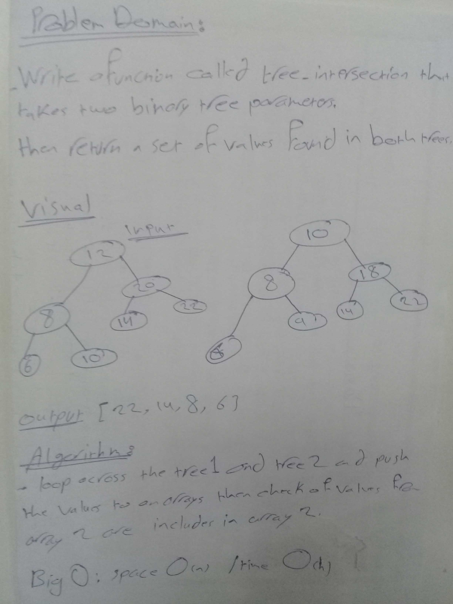

# tree_intersection

**create a repeated-word function that takes lengthy string parameter and returns the first repeated word**

## Challenge
**Write a function called tree_intersection that takes two binary tree parameters.**
**Without utilizing any of the built-in library methods available to your language, return a set of values found in both trees..**

## Approach & Efficiency

Big O : space O(n), time O(n) 

### solution

