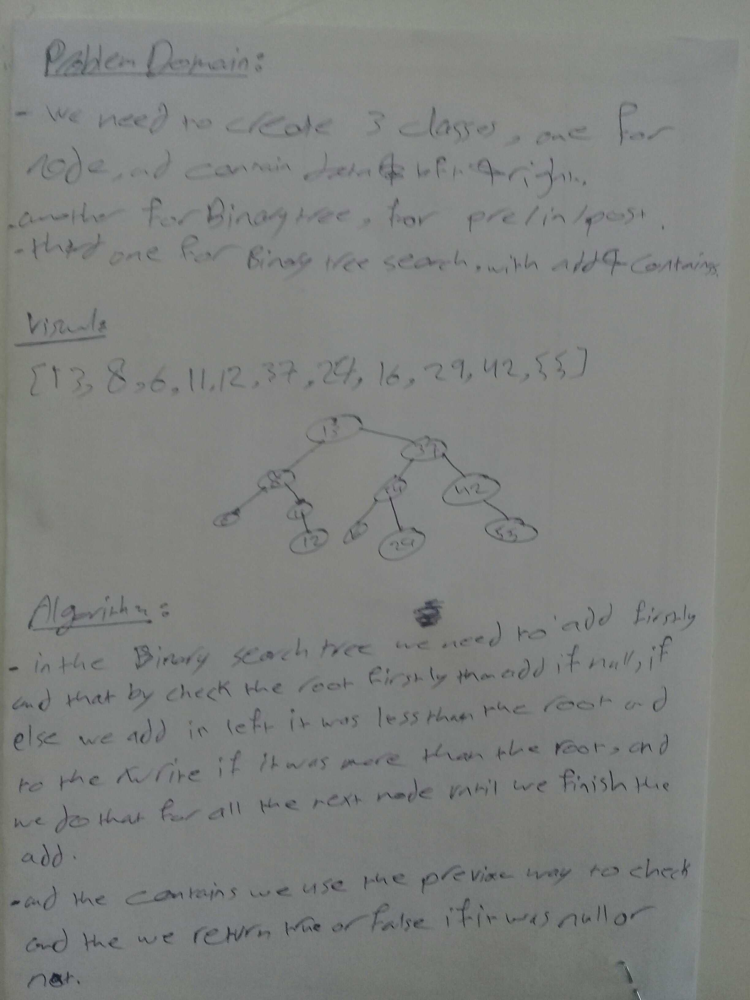

# Challenge 
**Create a Node class that has properties for the value stored in the node, the left child node, and the right child node.**
**Create a BinaryTree class**
**Define a method for each of the depth first traversals called preOrder, inOrder, and postOrder which returns an array of the values, ordered appropriately.**

## Approach & Efficiency
* Big O : for add & contains

* time O(1)
* space O(1)

* Big O : for pre in post

* time O(n)
* space O(n)
## Solution
### UML

